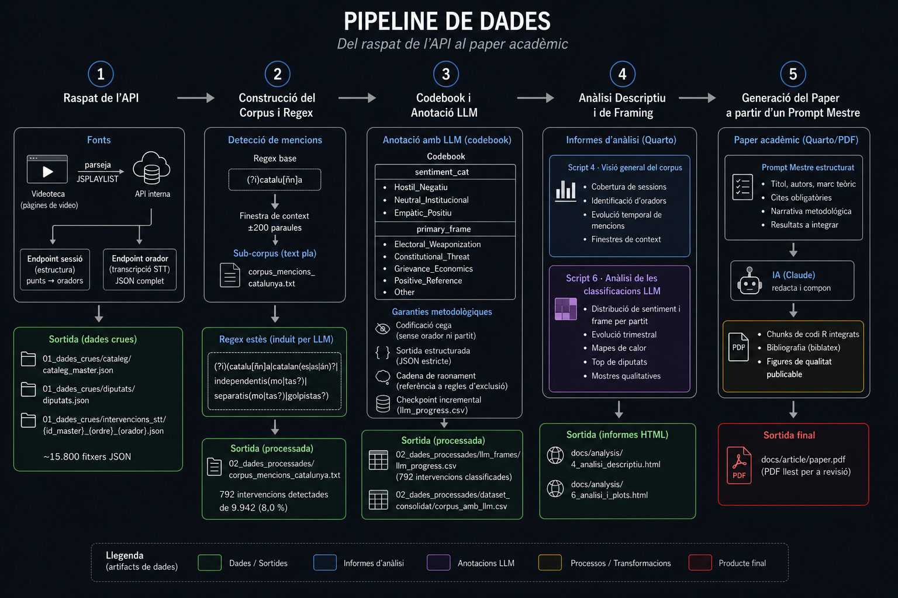

# Parliamentary Framing LLM

> **Repositori de mostra.** Aquest projecte és una demostració funcional d'un pipeline complet de ciència social computacional assistit per IA, des del raspat brut de l'API fins a un esborrany de paper acadèmic. Utilitza el Parlament d'Andalusia com a cas d'estudi però el pipeline està dissenyat com a plantilla replicable per a qualsevol altre ús.

**Paper:** [Catalonia as an Electoral Weapon: Discursive Framing and Territorial Instrumentalization in the Parliament of Andalusia](docs/article/paper.pdf)

---

## El Pipeline



### 1 · Raspat de l'API

El Parlament d'Andalusia publica les sessions plenàries a través d'un arxiu de vídeo públic (videoteca). La seva API interna exposa dos endpoints: un de nivell de sessió que retorna l'estructura jeràrquica de l'ordre del dia (punts → oradors) i un de nivell d'orador que retorna un JSON complet de transcripció automàtica (STT) per a cada intervenció. Un raspador web resol els identificadors de sessió parsejant un bloc `JSPLAYLIST` incrustat a cada pàgina de vídeo.

**Sortida:** `01_dades_crues/cataleg/`, `01_dades_crues/diputats/`, `01_dades_crues/intervencions_stt/` (~15.800 fitxers JSON)

---

### 2 · Construcció del Corpus i Regex

Un regex de base (`(?i)catalu[ñn]a`) detecta mencions inicials de Catalunya. Per a cada coincidència es extreu una finestra de context de ±200 paraules, concatenades en un sub-corpus de text pla (`02_dades_processades/corpus_mencions_catalunya.txt`). Un LLM llegeix aquest sub-corpus i extreu, a partir de l'ús real dels diputats, el camp lèxic complet per referir-se a Catalunya. Això produeix el **regex estès**:

```
(?i)(catalu[ñn]a|catalan(es|as|án)?|independentis(mo|tas?)|separatis(mo|tas?)|golpistas?)
```

**Sortida:** 792 intervencions detectades de 9.942 (8,0 %)

---

### 3 · Codebook i Anotació LLM

Cada una de les 792 intervencions és classificada per GPT seguint un codebook estructurat amb dues dimensions:

| Variable | Categories |
|---|---|
| `sentiment_cat` | `Hostil_Negatiu` · `Neutral_Institucional` · `Empàtic_Positiu` |
| `primary_frame` | `Electoral_Weaponization` · `Constitutional_Threat` · `Grievance_Economics` · `Positive_Reference` · `Other` |

**Garanties metodològiques** (seguint [Halterman & Keith, 2024](https://arxiv.org/abs/2407.10747)):

- **Codificació cega** — el model només rep el text de la intervenció, sense identitat de l'orador ni partit.
- **Sortida estructurada** — les respostes es restringeixen a un esquema JSON estricte via `ellmer::chat_structured()`, eliminant al·lucinacions i garantint categories vàlides.
- **Cadena de raonament** — el model ha d'exposar el seu raonament amb referència explícita a les regles d'exclusió del codebook abans de classificar.
- **Checkpoint incremental** — les classificacions s'escriuen fila a fila a `llm_progress.csv`, fent l'execució idempotent i tolerant a interrupcions.

**Sortida:** `02_dades_processades/llm_frames/llm_progress.csv` · `02_dades_processades/dataset_consolidat/corpus_amb_llm.csv`


### 4 · Anàlisi Descriptiu i de Framing

Dos informes Quarto combinen el corpus STT amb les anotacions del LLM:

- **Script 4** — visió general del corpus: cobertura de sessions, identificació d'oradors, evolució temporal de mencions, finestres de context.  
- **Script 6** — anàlisi de les classificacions: distribució de sentiment i frame per partit, evolució trimestral, mapes de calor, top de diputats i mostres qualitatives.

#### Explora els informes

<p>
  <a href="https://catbru.github.io/parliamentary-framing-llm/analysis/4_analisi_descriptiu.html">
    
  </a>
  <a href="https://catbru.github.io/parliamentary-framing-llm/analysis/6_analisi_i_plots.html">
    
  </a>
</p>

**Sortida local:**  
`docs/analysis/4_analisi_descriptiu.html` · `docs/analysis/6_analisi_i_plots.html`


### 5 · Generació del Paper a partir d'un Prompt Mestre

El paper acadèmic es genera a partir de `docs/article/prompt_mestre.md`, un brief estructurat en markdown que especifica títol, autors, marc teòric, cites obligatòries, narrativa metodològica i resultats a integrar. Un assistent d'IA tradueix aquest brief en un document Quarto/PDF complet amb chunks de codi R integrats, bibliografia `biblatex` i figures de qualitat publicable.

**Sortida:** `docs/article/paper.pdf`

---

## Estructura del Projecte

```
andalusia-mostra/
│
├── 00_scripts_R/                 # Tots els scripts executables, en ordre
│   ├── 00_utils.R                # Funcions auxiliars compartides (logging, delays)
│   ├── 1_scraper_cataleg.R       # Construeix el catàleg de sessions (id_master)
│   ├── 2_scraping_diputats.R     # Descarrega el registre de diputats
│   ├── 3_api_sessions.R          # Descarrega els JSONs STT de totes les sessions
│   ├── 4_analisi_descriptiu.qmd  # Informe de visió general del corpus
│   ├── 5_llm_framing.R           # Classificació LLM (idempotent)
│   ├── 6_analisi_i_plots.qmd     # Informe d'anàlisi LLM
│   └── _quarto.yml               # Quarto: sortida → docs/analysis/
│
├── 01_dades_crues/               # Sortida bruta de l'API (no versionat)
│   ├── cataleg/
│   │   └── cataleg_master.json
│   ├── diputats/
│   │   └── diputats.json
│   └── intervencions_stt/
│       └── {id_master}_{ordre}_{orador}.json   (~15.800 fitxers)
│
├── 02_dades_processades/         # Dades processades (no versionat)
│   ├── corpus_mencions_catalunya.txt
│   ├── dataset_consolidat/
│   │   ├── corpus_intervencions.csv   # 9.942 files × 21 columnes
│   │   └── corpus_amb_llm.csv         # unit amb sortida LLM
│   └── llm_frames/
│       └── llm_progress.csv           # 792 intervencions classificades
│
├── docs/
│   ├── analysis/                 # Informes HTML renderitzats
│   │   ├── 4_analisi_descriptiu.html
│   │   └── 6_analisi_i_plots.html
│   ├── article/                  # Paper acadèmic
│   │   ├── prompt_mestre.md      # Prompt mestre usat per generar el paper
│   │   ├── paper.qmd             # Codi font Quarto
│   │   ├── paper.pdf             # PDF renderitzat
│   │   └── references.bib
│   ├── context/                  # Literatura de referència
│   └── previous/                 # Codebook i diari de recerca anteriors
│
├── .env                          # Claus d'API (no versionat — vegeu example.env)
├── example.env                   # Plantilla de variables d'entorn necessàries
├── CLAUDE.md                     # Instruccions per a l'agent d'IA
└── PLAN.md                       # Pla mestre i documentació de l'API
```

---

## Re-execució

### Prerequisits

```r
install.packages(c("httr2", "rvest", "jsonlite", "dplyr", "tidyverse",
                   "lubridate", "stringr", "ellmer", "scales",
                   "knitr", "kableExtra", "patchwork"))
```

Copia `example.env` a `.env` i omple les claus d'API:

```bash
cp example.env .env
# edita .env amb OPENAI_API=sk-...
```

### Execució en ordre

```bash
# 1. Construeix el catàleg de sessions
Rscript 00_scripts_R/1_scraper_cataleg.R

# 2. Descarrega el registre de diputats
Rscript 00_scripts_R/2_scraping_diputats.R

# 3. Descarrega les transcripcions STT de totes les sessions
Rscript 00_scripts_R/3_api_sessions.R

# 4. Informe descriptiu del corpus  →  docs/analysis/4_analisi_descriptiu.html
quarto render 00_scripts_R/4_analisi_descriptiu.qmd

# 5. Classificació LLM  →  02_dades_processades/llm_frames/llm_progress.csv
#    (idempotent: es pot interrompre i reprendre sense perdre feina)
Rscript 00_scripts_R/5_llm_framing.R

# 6. Informe d'anàlisi LLM  →  docs/analysis/6_analisi_i_plots.html
quarto render 00_scripts_R/6_analisi_i_plots.qmd

# 7. Renderitza el paper acadèmic  →  docs/article/paper.pdf
quarto render docs/article/paper.qmd --to pdf
```

> Els scripts 1–3 fan peticions de xarxa i escriuen a `01_dades_crues/`. Salten els fitxers que ja existeixen al disc, de manera que les execucions parcials són segures. L'script 5 escriu a més una fila a la vegada al CSV de checkpoint, tolerant qualsevol interrupció.
